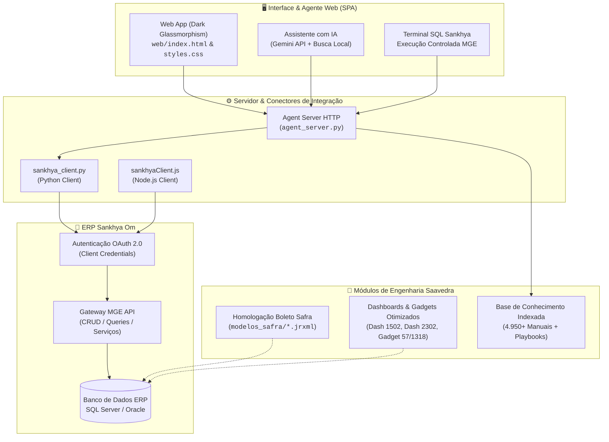

<div align="center">

# 🚀 AGENTE SAAVEDRA
### Central de Inteligência, Integração ERP Sankhya Om & Engenharia Financeira

<p align="center">
  
  
  
  
  
  
  
</p>

<p align="center">
  <b>Plataforma corporativa da Saavedra Representações Ltda</b> desenvolvida para automação de processos críticos no ecossistema médico-hospitalar e OPME: conectividade via API Gateway com o <b>ERP Sankhya Om</b>, homologação bancária de boletos (Banco Safra), engenharia de relatórios JasperReports, inteligência de negócios (BI & Dashboards) e suporte operacional com Inteligência Artificial.
</p>

<p align="center">
  <a href="#-1-visão-geral-da-solução"><kbd>🔍 Visão Geral</kbd></a> •
  <a href="#-2-arquitetura-do-sistema"><kbd>🏛️ Arquitetura</kbd></a> •
  <a href="#-3-módulos-do-projeto"><kbd>📦 Módulos</kbd></a> •
  <a href="#-4-estrutura-de-diretórios"><kbd>📂 Diretórios</kbd></a> •
  <a href="#-5-instalação-e-configuração"><kbd>⚙️ Configuração</kbd></a> •
  <a href="#-6-como-executar"><kbd>▶️ Execução</kbd></a> •
  <a href="#-7-segurança-e-boas-práticas"><kbd>🛡️ Segurança</kbd></a>
</p>

---

</div>

<style>
  /* Suporte a visualizadores com renderização de CSS */
  .card-container {
    display: grid;
    grid-template-columns: repeat(auto-fit, minmax(280px, 1fr));
    gap: 16px;
    margin: 20px 0;
  }
  .tech-card {
    background: rgba(19, 25, 38, 0.85);
    border: 1px solid rgba(255, 255, 255, 0.1);
    border-radius: 12px;
    padding: 16px;
    box-shadow: 0 4px 20px rgba(0,0,0,0.3);
  }
</style>

## 📋 1. Visão Geral da Solução

A **Saavedra Representações Ltda** atua no setor médico-hospitalar com distribuição de produtos cirúrgicos e materiais de alta complexidade (**OPME**). Suas operações exigem precisão absoluta em faturamento consignado, cumprimento de regras de convênios (ex: Unimed 258), faturamento de licitações públicas (HCPA, PMPA) e emissão de cobrança bancária com validação estrita.

<table>
  <tr>
    <td width="33%" valign="top">
      <div align="center"><h3>🔌 Gateway Sankhya</h3></div>
      <p>Conectores desacoplados em <b>Python</b> e <b>Node.js</b> com autenticação <b>OAuth 2.0</b> transparente (renovação automática de token) e zero dependências externas pesadas.</p>
      <ul>
        <li>CRUD em entidades nativas</li>
        <li>Execução de serviços MGE</li>
        <li>Alternância Sandbox / Produção</li>
      </ul>
    </td>
    <td width="33%" valign="top">
      <div align="center"><h3>🤖 IA & Web Especialista</h3></div>
      <p>Ambiente web moderno em <b>Dark Glassmorphism</b> integrado à API <b>Google Gemini</b> e motor local de busca semântica em base proprietária.</p>
      <ul>
        <li>Chat assistente operacional</li>
        <li>Terminal SQL Sankhya seguro</li>
        <li>Navegador de manuais ERP</li>
      </ul>
    </td>
    <td width="33%" valign="top">
      <div align="center"><h3>🏦 Homologação Safra</h3></div>
      <p>Reconstrução milimétrica do layout de boleto bancário <b>Banco Safra (422-7)</b> em JasperReports <code>.jrxml</code> atendendo às normas FEBRABAN/CNAB 400.</p>
      <ul>
        <li>Linha digitável horizontal contínua</li>
        <li>Correção do Sacador / Avalista</li>
        <li>Mockups de homologação em PNG/PDF</li>
      </ul>
    </td>
  </tr>
  <tr>
    <td width="33%" valign="top">
      <div align="center"><h3>📊 Otimização de BI</h3></div>
      <p>Engenharia de dados e correção de metadados em dashboards e gadgets do Sankhya Om para eliminar gargalos e erros SQL.</p>
      <ul>
        <li><b>Dash 1502:</b> Produtos de Terceiros</li>
        <li><b>Dash 2302:</b> Licitações (Modalidades)</li>
        <li><b>Gadget 1318 & 57:</b> Correção de subqueries</li>
      </ul>
    </td>
    <td width="33%" valign="top">
      <div align="center"><h3>📚 Base de Conhecimento</h3></div>
      <p>Acervo estruturado com <b>mais de 4.950 manuais técnicos</b> do Sankhya indexados, acompanhados de playbooks cirúrgicos Saavedra.</p>
      <ul>
        <li>Regras TOPs (1000, 1005, 1107, 1112)</li>
        <li>Mapeamento de campos adicionais (<code>AD_</code>)</li>
        <li>Reforma Tributária (IBS / CBS)</li>
      </ul>
    </td>
    <td width="33%" valign="top">
      <div align="center"><h3>⚡ Scripts Operacionais</h3></div>
      <p>Conjunto de ferramentas em Python para geração automatizada de relatórios executivos e auditorias de dados.</p>
      <ul>
        <li>Conversor Word/Excel de vendas</li>
        <li>Auditoria de notas e remessas</li>
        <li>Scripts de renderização visual</li>
      </ul>
    </td>
  </tr>
</table>

---

## 🏛️ 2. Arquitetura do Sistema



---

## 📦 3. Módulos do Projeto

<details open>
<summary><b>3.1. Conectores e API Gateway Sankhya (Python & Node.js)</b></summary>
<br/>

Camada universal de comunicação com o ERP Sankhya Om, desenhada com foco em resiliência, performance e facilidade de implantação:

<table>
  <thead>
    <tr>
      <th>Recurso</th>
      <th>Python (<code>sankhya_client.py</code>)</th>
      <th>Node.js (<code>sankhyaClient.js</code>)</th>
    </tr>
  </thead>
  <tbody>
    <tr>
      <td><b>Autenticação</b></td>
      <td>OAuth 2.0 (Client Credentials com renovação automática prévia de 30s)</td>
      <td>OAuth 2.0 (Client Credentials com renovação automática prévia de 30s)</td>
    </tr>
    <tr>
      <td><b>Dependências</b></td>
      <td>Apenas Standard Library (<code>urllib.request</code>, <code>json</code>, <code>os</code>, <code>time</code>)</td>
      <td><code>fetch</code> nativo (Node.js 18+) sem pacotes npm externos pesados</td>
    </tr>
    <tr>
      <td><b>Métodos</b></td>
      <td><code>load_records</code>, <code>save_record</code>, <code>call_service</code></td>
      <td><code>loadRecords</code>, <code>saveRecord</code>, <code>callService</code></td>
    </tr>
    <tr>
      <td><b>Ambientes</b></td>
      <td>Alternância imediata via <code>SANKHYA_ENV</code> (sandbox / production)</td>
      <td>Alternância imediata via <code>SANKHYA_ENV</code> (sandbox / production)</td>
    </tr>
  </tbody>
</table>

#### Exemplo de Uso em Python:
```python
from sankhya_client import SankhyaClient

# Instanciação com leitura automática do .env
client = SankhyaClient()
client.authenticate()

# Consulta otimizada de parceiros cadastrados
parceiros = client.load_records(
    entity_name="Parceiro",
    fields=["CODPARC", "NOMEPARC", "CGC_CPF"],
    criteria="this.CODPARC > 0"
)
print(f"Total de parceiros retornados: {len(parceiros)}")
```
</details>

<br/>

<details open>
<summary><b>3.2. Agente Web & Chatbot com IA</b></summary>
<br/>

Interface SPA (Single Page Application) localizada em `web/`, executada pelo backend `agent_server.py`:

- **Design System Dark Glassmorphism:** Desenvolvido com CSS moderno, paleta HSL escura, efeito de vidro fosco (`backdrop-filter`), tipografia *Plus Jakarta Sans* e gráficos integrados com Chart.js.
- **Chatbot Híbrido (Dual-Engine):**
  - **Modo Nuvem (Google Gemini):** Raciocínio avançado alimentado por prompt de contexto especializado no negócio Saavedra e no Sankhya Om.
  - **Modo Local / Offline:** Consulta direta aos manuais e playbooks locais via motor de pontuação em `gerenciador_conhecimento.py`.
- **Terminal SQL Sankhya:** Permite a administradores de TI rodar queries de diagnóstico diretamente na base através do serviço `DbExplorerSP.executeQuery` com validação de segurança.
- **Visualizador de Manuais do ERP:** Renderizador dinâmico de documentação em Markdown com busca instantânea.
</details>

<br/>

<details open>
<summary><b>3.3. Base de Conhecimento & Playbooks Saavedra</b></summary>
<br/>

Acervo técnico centralizado em `base_conhecimento/`, indexado e preparado para busca rápida:

<table>
  <thead>
    <tr>
      <th>Arquivo / Playbook</th>
      <th>Descrição Operacional</th>
    </tr>
  </thead>
  <tbody>
    <tr>
      <td><code>01_perfil_e_regras_de_negocio.md</code></td>
      <td>Diretrizes de faturamento cirúrgico OPME, Unimed 258 e TOPs (1000, 1005, 1107, 1112).</td>
    </tr>
    <tr>
      <td><code>02_campos_customizados_ad.md</code></td>
      <td>Mapeamento completo dos campos <code>AD_</code> em <code>TGFCAB</code> e <code>TGFITE</code> (Médico, Hospital, Paciente, Guia).</td>
    </tr>
    <tr>
      <td><code>03_relatorios_jasper_modelo14_relatorio67.md</code></td>
      <td>Configurações de impressão do Modelo 14 e Faturas Hospitalares em Jasper.</td>
    </tr>
    <tr>
      <td><code>05_dashboards_licitacoes_2301_2302.md</code></td>
      <td>Gestão de pregões e acompanhamento de aditivos de contratos públicos (HCPA, PMPA).</td>
    </tr>
    <tr>
      <td><code>07_configuracao_contas_contabeis_banco_safra.md</code></td>
      <td>Parametrização contábil, histórico padrão e conciliação da conta Safra.</td>
    </tr>
    <tr>
      <td><code>08_reforma_tributaria_ibs_cbs_configuracao_sankhya.md</code></td>
      <td>Adequação fiscal do ERP às regras da EC 132/LC 214 (IBS, CBS e IS).</td>
    </tr>
    <tr>
      <td><code>09_automacao_retencoes_orgaos_publicos_trigger_anexo3.md</code></td>
      <td>Triggers automáticas para retenção de tributos (IRRF, PIS/COFINS/CSLL, ISS) em órgãos públicos.</td>
    </tr>
    <tr>
      <td><code>10_correcao_calculo_icms_st_gnre_compras_importados.md</code></td>
      <td>Regras de MVA, base dupla e recolhimento de GNRE para produtos importados.</td>
    </tr>
    <tr>
      <td><code>11_implantacao_cobranca_banco_safra_boleto_cnab400.md</code></td>
      <td>Dossiê integral de homologação da carteira de cobrança bancária Safra.</td>
    </tr>
    <tr>
      <td><code>HISTORICO_MELHORIAS_E_CONSERTOS.md</code></td>
      <td>Registro cronológico de incidentes, causas-raiz, correções e validações do usuário.</td>
    </tr>
  </tbody>
</table>
</details>

<br/>

<details open>
<summary><b>3.4. Homologação Bancária & Layouts de Boleto (Banco Safra)</b></summary>
<br/>

Engenharia visual e refatoração dos arquivos `.jrxml` do boleto do **Banco Safra (422-7)** para o módulo `TSIIRE` do Sankhya Om:

- **Principais Correções Realizadas:**
  1. **Cabeçalho & Linha Digitável:** Vetorização e incorporação do logotipo em Base64 (`safra_logo.b64`), código de compensação `422-7` e linha digitável disposta em linha horizontal única sem quebras errôneas.
  2. **Deslocamento e Visibilidade do Sacador/Avalista:** Eliminação de sobreposição de elementos na Ficha de Compensação e Recibo do Pagador, garantindo exibição nítida de Razão Social, CNPJ/CPF, Endereço e Cidade/UF.
  3. **Conformidade FEBRABAN:** Ajustes de proporção e margens de proteção do código de barras e blocos de instrução bancária.
- **Modelos Homologados em `modelos_safra/`:**
  - `Bol_Safra_HOMOLOGADO.jrxml`: Layout final aprovado para produção.
  - `Bol_Safra_LINHA_UNICA.jrxml`: Modelo com formatação horizontal de alta legibilidade.
  - `Bol_Safra_DEFINITIVO.jrxml`: Modelo com compatibilidade estrita às tags de impressão do ERP.
- **Renderização e Auditoria Visual:**
  - `render_preview_homologado.py` e `render_preview_boleto.py`: Permitem gerar prévias visuais instantâneas (`.png` e `.pdf`) sem necessidade de emitir títulos reais no ERP.
</details>

<br/>

<details open>
<summary><b>3.5. Dashboards, Gadgets & Otimizações de BI</b></summary>
<br/>

Refatoração de painéis de Business Intelligence no Sankhya Om para aumento de performance e correção de inconsistências lógicas:

- **Dashboard 1502 (Produtos de Terceiros em Nosso Poder):**
  - Documentação em `Dashboards/metadata_1502_-_produtos_de_terceiros_em_nosso_poder/ANALISE_PROS_E_CONTRAS_DASHBOARD_1502.md`.
  - XML otimizado (`dashboardMetadata_otimizado.xml`), minimizando consultas repetitivas de saldo em consignações.
- **Dashboard 2302 (Acompanhamento de Contratos de Licitação):**
  - Adicionada coluna visual **MODALIDADE** (Aditivo de Contrato, Pregão Eletrônico, etc.) via `LEFT JOIN` nas tabelas `LGH_LICCAB` e `LGH_LICMOD`.
  - **Gadget 57 corrigido:** Eliminação de cálculos que geravam saldos negativos quando múltiplos aditivos faziam referência ao mesmo pregão público (HCPA).
- **Gadget 1318 (Análise de Compras):**
  - Resolução do erro clássico *"subconsulta retornou mais de 1 valor"* em SQL Server, reescrevendo agregação de pedidos pendentes em `gadget_1318_corrigido.xml`.
</details>

---

## 📂 4. Estrutura de Diretórios

```text
├── .agents/                               # Regras e comportamentos customizados do assistente de IA
├── .env.example                           # Modelo de variáveis de ambiente
├── .gitignore                             # Filtro de segurança para credenciais e arquivos temporários
├── README.md                              # Documentação principal em Markdown e HTML5
├── README.html                            # Versão interativa web com CSS3 e Dark Glassmorphism
├── package.json                           # Metadados e scripts de automação Node.js
│
├── sankhya_client.py                      # Conector Python universal para a API Gateway Sankhya
├── sankhyaClient.js                       # Conector Node.js universal para a API Gateway Sankhya
├── test_connection.py                     # Script de teste de autenticação e ping (Python)
├── testConnection.js                      # Script de teste de autenticação e ping (Node.js)
│
├── agent_server.py                        # Backend HTTP/API para a interface web do Agente
├── gerenciador_conhecimento.py            # Motor de busca local na base de conhecimento
│
├── web/                                   # Frontend do Agente Saavedra (Dark Glassmorphism)
│   ├── index.html                         # Estrutura HTML5 da interface SPA
│   ├── styles.css                         # Design System com tokens e tema escuro
│   ├── app.js                             # Controlador de chat, terminal SQL e visualizador
│   └── chart.min.js                       # Biblioteca Chart.js para dashboards
│
├── modelos_safra/                         # Layouts JasperReports e arquivos de homologação
│   ├── Bol_Safra_HOMOLOGADO.jrxml         # Layout oficial aprovado Banco Safra
│   ├── Bol_Safra_LINHA_UNICA.jrxml        # Layout com linha digitável contínua
│   ├── Bol_Safra_DEFINITIVO.jrxml         # Layout com tags nativas Sankhya
│   ├── Boleto_Itau.jrxml                  # Modelo referencial comparativo
│   └── safra_logo.b64                     # Logotipo Safra codificado em Base64
│
├── Dashboards/                            # Metadados e documentação técnica de BI
│   ├── metadata_1502_-_produtos_de_terceiros_em_nosso_poder/
│   └── metadata_2302_-_acompanhamento_contratos_de_licitacao/
│
├── base_conhecimento/                     # Acervo técnico indexado
│   ├── ambiente_saavedra/                 # Playbooks e diretrizes internas da Saavedra
│   ├── comercial_e_vendas/                # Manuais técnicos Sankhya Om
│   ├── financeiro_e_patrimonio/           # Manuais técnicos Sankhya Om
│   ├── suprimentos_e_estoque/             # Manuais técnicos Sankhya Om
│   └── metadata_artigos.json              # Índice unificado com mais de 4.950 artigos
│
└── scratch/                               # Scripts utilitários de inspeção e engenharia reversa
```

---

## ⚙️ 5. Instalação e Configuração

### 📋 Pré-requisitos
- **Python 3.10 ou superior** instalado no ambiente
- **Node.js 18 ou superior** (opcional, para execução de conectores JS)
- **Git** configurado

### 1. Clonagem do Repositório
```bash
git clone https://github.com/tisaav/Agente-Saavedra.git
cd Agente-Saavedra
```

### 2. Configuração das Credenciais (`.env`)
Copie o template de ambiente e preencha as chaves fornecidas pela TI / Sankhya:

```bash
cp .env.example .env
```

Edite o arquivo `.env`:
```env
# Configurações da API Sankhya Om
SANKHYA_CLIENT_ID=seu_client_id_aqui
SANKHYA_CLIENT_SECRET=seu_client_secret_aqui
SANKHYA_X_TOKEN=seu_x_token_aqui
SANKHYA_ENV=sandbox   # Opções: "sandbox" (testes) ou "production" (produção)

# Configurações do Agente de IA (Opcional)
GEMINI_API_KEY=sua_chave_gemini_aqui
```

> [!WARNING]
> **Atenção à Segurança:** O arquivo `.env` nunca deve ser commitado no repositório. Ele está protegido pelo `.gitignore`.

---

## ▶️ 6. Como Executar

<table>
  <thead>
    <tr>
      <th>Ação</th>
      <th>Comando PowerShell / Terminal</th>
      <th>Descrição</th>
    </tr>
  </thead>
  <tbody>
    <tr>
      <td><b>Validar Conexão Python</b></td>
      <td><code>python test_connection.py</code></td>
      <td>Autentica via OAuth 2.0 e realiza ping no Gateway Sankhya.</td>
    </tr>
    <tr>
      <td><b>Validar Conexão Node.js</b></td>
      <td><code>node testConnection.js</code> ou <code>npm test</code></td>
      <td>Executa a mesma validação utilizando o conector em JavaScript.</td>
    </tr>
    <tr>
      <td><b>Iniciar Agente Web</b></td>
      <td><code>python agent_server.py 3000</code> ou <code>npm run start:web</code></td>
      <td>Inicia o servidor local na porta 3000. Acesse em <code>http://localhost:3000</code>.</td>
    </tr>
    <tr>
      <td><b>Consulta CLI à Base</b></td>
      <td><code>python gerenciador_conhecimento.py "regras unimed 258"</code></td>
      <td>Busca inteligente nos manuais locais e playbooks Saavedra.</td>
    </tr>
    <tr>
      <td><b>Gerar Prévia de Boleto</b></td>
      <td><code>python render_preview_homologado.py</code></td>
      <td>Gera a renderização em imagem <code>preview_boleto_safra_homologado.png</code>.</td>
    </tr>
  </tbody>
</table>

---

## 🛡️ 7. Segurança e Boas Práticas

> [!IMPORTANT]
> **Diretrizes de Governança e Ambientes:**
> 1. **Separação de Ambientes:** Sempre efetue homologações de novos relatórios Jasper (`.jrxml`), atualizações de dashboards e rotinas de integração primeiramente no ambiente **Sandbox** antes de aplicar na base de produção.
> 2. **Validação de Consultas SQL:** Consultas executadas pelo Terminal SQL do Agente Web devem ser limitadas a comandos de leitura (`SELECT`) com cláusulas `WHERE` restritivas para não onerar o banco de dados ERP.
> 3. **Gestão de Segredos:** Tokens de API e credenciais devem ser rotacionados periodicamente conforme a política interna de segurança da informação da Saavedra.

---

<div align="center">

### 🏢 Saavedra Representações Ltda
*Excelência, Tecnologia e Inovação no Ecossistema Hospitalar Sankhya Om*

<sub>Documentação atualizada em 2026 • Mantida pela equipe de Tecnologia e Engenharia Saavedra</sub>

</div>
