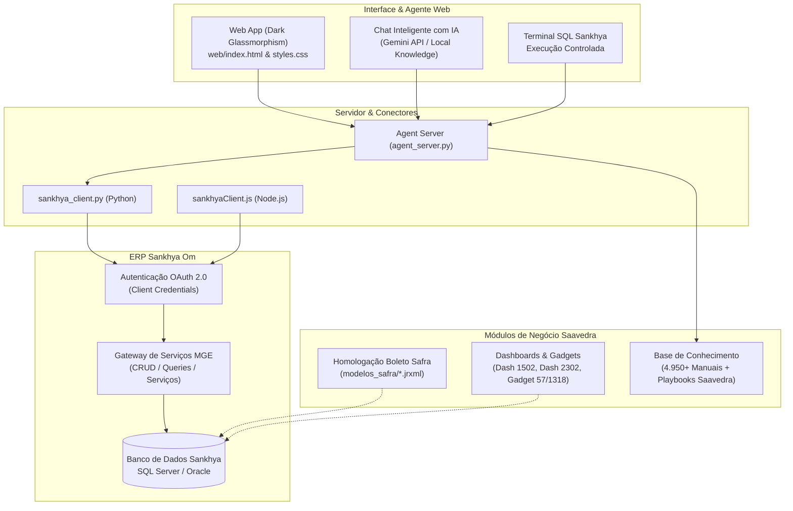

# 🚀 Agente Saavedra - Central de Integração, Inteligência e Automação Sankhya Om

> **Plataforma corporativa da Saavedra Representações Ltda** para automação de processos, conectividade via API Gateway com o **ERP Sankhya Om**, homologação de layouts bancários (Banco Safra), engenharia de relatórios JasperReports, inteligência de negócios (BI/Dashboards) e suporte operacional a cirurgias/OPME com Inteligência Artificial.

---

## 📑 Tabela de Conteúdos

- [1. Visão Geral da Solução](#1-visão-geral-da-solução)
- [2. Arquitetura do Sistema](#2-arquitetura-do-sistema)
- [3. Módulos do Projeto](#3-módulos-do-projeto)
  - [3.1. Conectores e API Gateway Sankhya (Python & Node.js)](#31-conectores-e-api-gateway-sankhya-python--nodejs)
  - [3.2. Agente Web & Chatbot com IA](#32-agente-web--chatbot-com-ia)
  - [3.3. Base de Conhecimento e Playbooks Saavedra](#33-base-de-conhecimento-e-playbooks-saavedra)
  - [3.4. Homologação Bancária & Layouts de Boleto (Banco Safra)](#34-homologação-bancária--layouts-de-boleto-banco-safra)
  - [3.5. Dashboards, Gadgets e Correções de BI (Sankhya Om)](#35-dashboards-gadgets-e-correções-de-bi-sankhya-om)
  - [3.6. Automações e Relatórios Operacionais](#36-automações-e-relatórios-operacionais)
- [4. Estrutura de Diretórios](#4-estrutura-de-diretórios)
- [5. Instalação e Configuração](#5-instalação-e-configuração)
- [6. Como Executar](#6-como-executar)
- [7. Segurança e Boas Práticas](#7-segurança-e-boas-práticas)

---

## 1. Visão Geral da Solução

A **Saavedra Representações Ltda** atua no segmento médico-hospitalar e de materiais de alta complexidade (OPME / cirurgias), exigindo conformidade rigorosa em processos de faturamento, controle de consignação, remessas hospitalares, licitações públicas e emissão financeira.

Este repositório centraliza todas as iniciativas de engenharia e tecnologia desenvolvidas para o ambiente Saavedra:
1. **Integração com o Sankhya Om:** Conectores leves e universais que operam tanto em Python quanto em Node.js com autenticação OAuth 2.0 segura.
2. **IA Operacional Especializada:** Interface web moderna (Dark Glassmorphism) com agente de IA conectado à base de conhecimento corporativa e ao banco de dados Sankhya.
3. **Engenharia de Boletos Bancários:** Homologação e reconstrução do layout do Banco Safra (`.jrxml`) para resolução de bugs gráficos, alinhamento de linha digitável e dados de Sacador/Avalista.
4. **Otimização de Dashboards e BI:** Ajustes de performance em consultas de bancos de dados, correção de erros de subconsultas com múltiplos retornos (Gadget 1318, Gadget 57) e documentação arquitetural (Dashboard 1502).
5. **Base de Conhecimento Técnica:** Mais de 4.950 manuais técnicos do ERP Sankhya indexados, acompanhados de documentação detalhada sobre regras tributárias, playbooks cirúrgicos e campos personalizados (`AD_`).

---

## 2. Arquitetura do Sistema



---

## 3. Módulos do Projeto

### 3.1. Conectores e API Gateway Sankhya (Python & Node.js)

O projeto implementa uma camada de abstração desacoplada para conexão com as APIs do Sankhya Om:

- **Autenticação OAuth 2.0:** Suporte ao fluxo de *Client Credentials*, com gerenciamento transparente de tokens em cache e renovação automática 30 segundos antes de expirar.
- **Zero Dependências Pesadas:** 
  - Em Python: utiliza exclusivamente bibliotecas da standard library (`urllib.request`, `json`, `os`, `time`).
  - Em Node.js: utiliza `fetch` nativo (compatível com Node.js 18+).
- **CRUD e Serviços Personalizados:** Métodos utilitários para consulta e escrita em entidades (`load_records`, `save_record`) e invocação de serviços arbitrários do MGE (`call_service`).
- **Suporte Multi-Ambiente:** Troca imediata entre ambiente de homologação (`sandbox`) e produção através da variável `SANKHYA_ENV`.

#### Exemplo em Python (`sankhya_client.py`):
```python
from sankhya_client import SankhyaClient

client = SankhyaClient()
client.authenticate()

# Consulta de parceiros
parceiros = client.load_records(
    entity_name="Parceiro",
    fields=["CODPARC", "NOMEPARC", "CGC_CPF"],
    criteria="this.CODPARC > 0"
)
```

---

### 3.2. Agente Web & Chatbot com IA

Localizado no diretório `web/` com backend em `agent_server.py`:

- **Design Premium:** Interface completa inspirada no conceito Dark Glassmorphism, tipografia moderna, componentes responsivos e gráficos via Chart.js.
- **Chat Especialista:**
  - Responde dúvidas sobre regras operacionais, rotinas do Sankhya e regras Saavedra.
  - Suporta integração direta com a API do Google Gemini via chave configurável na interface.
  - Modo Offline/Local: opera por meio de busca textual e semântica diretamente nos manuais locais.
- **Terminal SQL Sankhya:** Permite executar consultas SQL de diagnóstico diretamente no banco do ERP através da API do Gateway.
- **Visualizador de Manuais:** Interface dedicada para navegar por artigos e resoluções de problemas técnicos do ERP.

---

### 3.3. Base de Conhecimento e Playbooks Saavedra

A pasta `base_conhecimento/` reúne um dos maiores acervos técnicos e operacionais documentados para o ambiente hospitalar/Sankhya:

- **Mais de 4.950 Manuais Técnicos Oficiais:** Catalogados por módulos (Comercial, Suprimentos, Financeiro, Fiscal, Produção, Contratos, etc.).
- **Ambiente Especializado Saavedra (`base_conhecimento/ambiente_saavedra/`):**
  - `01_perfil_e_regras_de_negocio.md`: Diretrizes sobre remessa e faturamento cirúrgico OPME, Unimed 258 e TOPs (1000, 1005, 1107, 1112).
  - `02_campos_customizados_ad.md`: Mapeamento de campos adicionais em `TGFCAB` e `TGFITE` (Médico, Paciente, Hospital, Convênio, Guia).
  - `03_relatorios_jasper_modelo14_relatorio67.md`: Configurações de impressão do Modelo 14 e Faturas Hospitalares.
  - `05_dashboards_licitacoes_2301_2302.md`: Análise de pregões, empenhos e aditivos contratuais (HCPA, PMPA).
  - `07_configuracao_contas_contabeis_banco_safra.md`: Parametrizações de plano de contas e conciliação bancária.
  - `08_reforma_tributaria_ibs_cbs_configuracao_sankhya.md`: Adaptação do ERP às novas regras da EC 132/LC 214.
  - `09_automacao_retencoes_orgaos_publicos_trigger_anexo3.md`: Triggers de retenção de tributos federais e municipais.
  - `10_correcao_calculo_icms_st_gnre_compras_importados.md`: Ajustes de cálculo de substituição tributária.
  - `11_implantacao_cobranca_banco_safra_boleto_cnab400.md`: Dossiê completo da implantação da carteira de cobrança Safra.
  - `HISTORICO_MELHORIAS_E_CONSERTOS.md`: Registro contínuo de incidentes, causas-raiz e soluções aplicadas.
- **Gerenciador de Conhecimento (`gerenciador_conhecimento.py`):** Script em Python com cache indexado (`.sections_cache.json`) e busca rápida com pontuação de relevância.

---

### 3.4. Homologação Bancária & Layouts de Boleto (Banco Safra)

Desenvolvimento, refatoração e homologação visual do boleto de cobrança bancária do **Banco Safra** em JasperReports (`.jrxml`) para uso no módulo `TSIIRE` do Sankhya:

- **Desafios e Correções Realizadas:**
  1. **Logotipo e Header:** Inclusão de logotipo de alta fidelidade em Base64 (`safra_logo.b64`), código do banco `422-7` e linha digitável em linha única horizontal sem quebras de texto inadequadas.
  2. **Correção do Sacador/Avalista:** Solução de sobreposições nos elementos gráficos da Ficha de Compensação e Recibo do Pagador que ocultavam os dados cadastrais do Sacador Avalista (`RAZAOSOCIAL`, `CGC_CPF`, `ENDERECO`, `CIDADE/UF`).
  3. **Alinhamento com Padrão FEBRABAN/CNAB 400:** Validação de dimensões de código de barras, campos de agência/código cedente e instruções de juros e mora.
- **Modelos Homologados em `modelos_safra/`:**
  - `Bol_Safra_HOMOLOGADO.jrxml`: Versão final aprovada com layout limpo e sacador/avalista posicionado.
  - `Bol_Safra_LINHA_UNICA.jrxml`: Versão com linha digitável contínua e cabeçalho vetorizado.
  - `Bol_Safra_DEFINITIVO.jrxml`: Modelo integrado com todas as tags de compatibilidade do Sankhya.
- **Scripts de Renderização de Teste:**
  - `render_preview_homologado.py` e `render_preview_boleto.py`: Geram mockups em imagem de alta resolução (`.png`) e PDFs para conferência visual sem depender de disparos manuais no ERP.

---

### 3.5. Dashboards, Gadgets e Correções de BI (Sankhya Om)

Otimizações em painéis de gestão à vista e relatórios analíticos:

- **Dashboard 1502 - Produtos de Terceiros em Nosso Poder:**
  - Análise aprofundada de prós e contras arquiteturais em `Dashboards/metadata_1502_-_produtos_de_terceiros_em_nosso_poder/ANALISE_PROS_E_CONTRAS_DASHBOARD_1502.md`.
  - Otimização do XML de metadados (`dashboardMetadata_otimizado.xml`), reduzindo sobrecarga de queries analíticas sobre movimentações de estoque consignado.
- **Dashboard 2302 - Licitações e Contratos:**
  - Investigação e correção do **Gadget 57** (`gadget_57_dash2302_CORRIGIDO.xml`), solucionando falhas em contratos com aditivos múltiplos e vinculação a pregões do HCPA.
- **Gadget 1318 - Análise de Compras:**
  - Correção do erro *"subconsulta retornou mais de 1 valor"* em ambientes SQL Server (`gadget_1318_corrigido.xml`), reestruturando joins e agregações de pedidos pendentes.

---

### 3.6. Automações e Relatórios Operacionais

Scripts utilitários para apoio aos processos de backoffice:

- `Relatorio_Vendas_BD_AAD.xlsx` e `converter_para_docx.py`: Conversão e formatação de relatórios de faturamento e vendas analíticas para apresentações executivas.
- `consultar_tgfcab.py` e `consultar_remessa.py`: Diagnóstico rápido de notas e remessas bancárias.

---

## 4. Estrutura de Diretórios

```text
├── .agents/                               # Regras e comportamentos customizados do assistente
├── .env.example                           # Modelo de variáveis de ambiente
├── .gitignore                             # Ignora credenciais, caches e arquivos temporários
├── README.md                              # Documentação oficial do projeto
├── package.json                           # Configuração e scripts Node.js
│
├── sankhya_client.py                      # Conector Sankhya para Python (Gateway e OAuth)
├── sankhyaClient.js                       # Conector Sankhya para Node.js (Gateway e OAuth)
├── test_connection.py                     # Validador de conexão e autenticação Python
├── testConnection.js                      # Validador de conexão e autenticação Node.js
│
├── agent_server.py                        # Servidor HTTP/API backend para o Agente Web
├── gerenciador_conhecimento.py            # Mecanismo de busca e indexação da base de conhecimento
│
├── web/                                   # Frontend do Agente Web Especialista
│   ├── index.html                         # Estrutura da aplicação (SPA Glassmorphism)
│   ├── styles.css                         # Folha de estilos moderna e responsiva
│   ├── app.js                             # Lógica de chat, terminal SQL e visualizador
│   └── chart.min.js                       # Biblioteca de gráficos
│
├── modelos_safra/                         # Modelos JasperReports e homologação de boletos
│   ├── Bol_Safra_HOMOLOGADO.jrxml         # Layout final homologado para o Banco Safra
│   ├── Bol_Safra_LINHA_UNICA.jrxml        # Layout com linha digitável contínua
│   ├── Bol_Safra_DEFINITIVO.jrxml         # Layout com suporte completo a tags Sankhya
│   ├── Boleto_Itau.jrxml                  # Modelo de referência comparativo (Itaú)
│   └── safra_logo.b64                     # Logotipo Safra codificado em Base64
│
├── Dashboards/                            # Engenharia de BI e Dashboards do Sankhya
│   └── metadata_1502_-_produtos_de_terceiros_em_nosso_poder/
│       ├── ANALISE_PROS_E_CONTRAS_DASHBOARD_1502.md # Análise arquitetural e técnica
│       ├── dashboardMetadata.xml          # XML original de metadados
│       └── dashboardMetadata_otimizado.xml# XML refatorado e otimizado
│
├── base_conhecimento/                     # Acervo técnico e playbooks
│   ├── ambiente_saavedra/                 # Manuais internos (OPME, tributário, boletos)
│   ├── comercial_e_vendas/                # Manuais Sankhya Om
│   ├── financeiro_e_patrimonio/           # Manuais Sankhya Om
│   ├── suprimentos_e_estoque/             # Manuais Sankhya Om
│   └── metadata_artigos.json              # Metadados de 4.950+ artigos indexados
│
└── scratch/                               # Scripts utilitários de inspeção e engenharia reversa
```

---

## 5. Instalação e Configuração

### Pré-requisitos
- **Python 3.10 ou superior**
- **Node.js 18 ou superior** (opcional, necessário se for usar conectores Node.js)
- **Git** instalado no sistema

### 1. Clonar o Repositório
```bash
git clone https://github.com/tisaav/Agente-Saavedra.git
cd Agente-Saavedra
```

### 2. Configurar Variáveis de Ambiente
Copie o modelo de variáveis de ambiente e preencha suas credenciais do Sankhya:

```bash
cp .env.example .env
```

Edite o arquivo `.env`:
```env
# Credenciais da API Sankhya Om
SANKHYA_CLIENT_ID=seu_client_id_aqui
SANKHYA_CLIENT_SECRET=seu_client_secret_aqui
SANKHYA_X_TOKEN=seu_x_token_aqui
SANKHYA_ENV=sandbox   # Utilize "sandbox" ou "production"
```

> ⚠️ **Atenção:** O arquivo `.env` está explicitamente configurado no `.gitignore` para nunca ser versionado. Jamais compartilhe suas credenciais reais publicamente.

---

## 6. Como Executar

### 1. Testar Conexão com o ERP Sankhya

**Em Python:**
```bash
python test_connection.py
```

**Em Node.js:**
```bash
node testConnection.js
# ou via npm:
npm test
```

### 2. Iniciar o Agente Web (Interface Gráfica)

Execute o servidor local:
```bash
python agent_server.py 3000
# ou via npm:
npm run start:web
```

Abra no navegador:
```
http://localhost:3000
```

### 3. Consultar a Base de Conhecimento via CLI

```bash
python gerenciador_conhecimento.py "regras faturamento unimed 258"
```

### 4. Gerar Prévias do Boleto Safra

```bash
python render_preview_homologado.py
```
A imagem resultante será salva no diretório raiz como `preview_boleto_safra_homologado.png`.

---

## 7. Segurança e Boas Práticas

- **Credenciais Sensíveis:** Tokens, chaves de API do Google Gemini e senhas de banco devem permanecer exclusivamente no arquivo `.env` ou ser inseridos dinamicamente na interface web.
- **Ambiente de Testes:** Sempre valide novos layouts de boletos e alterações de dashboards primeiramente no ambiente de homologação (`sandbox` / base de testes do Sankhya) antes de efetuar o deploy em produção.
- **Controle de Versão:** Mantenha os arquivos `.jrxml` e `.xml` de dashboards versionados com commits descritivos para garantir rastreabilidade nas entregas.

---

**Desenvolvido para a Saavedra Representações Ltda**  
Tecnologia, Gestão e Inteligência no Ecossistema Sankhya Om.
