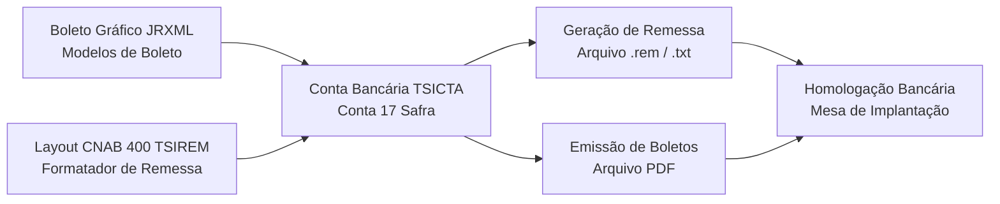

# 📋 Manual Completo: Implantação de Cobrança Bancária, Boletos e CNAB 400 no Sankhya

> **Classificação:** Procedimento Operacional Padrão (POP) / Arquitetura Financeira e TI  
> **Exemplo Base Documentado:** Banco Safra S.A. (Código 422 / Conta 17)  
> **Compatibilidade do ERP:** Sankhya-Om (HTML5) | Banco de Dados: Microsoft SQL Server  
> **Finalidade:** Servir de guia definitivo para qualquer profissional configurar do zero ou dar manutenção em cobrança registrada, boletos gráficos (Jasper) e arquivos de remessa/retorno (CNAB 400) para qualquer instituição bancária.

---

## 🧭 Índice do Guia

1. [Visão Geral da Arquitetura de Cobrança no Sankhya](#1-visão-geral-da-arquitetura)
2. [Fase 1: Configuração do Modelo Visual do Boleto (JasperReports)](#2-fase-1-modelo-visual-do-boleto-jasperreports)
3. [Fase 2: Configuração da Conta Bancária (Tela "Contas")](#3-fase-2-configuração-da-conta-bancária-tela-contas)
4. [Fase 3: Configuração do Layout CNAB 400 (Formatador de Remessa)](#4-fase-3-configuração-do-layout-cnab-400-formatador-de-remessa)
5. [Fase 4: Geração e Emissão do Arquivo de Remessa (.rem / .txt)](#5-fase-4-geração-do-arquivo-de-remessa)
6. [Fase 5: Protocolo de Homologação com a Mesa de Implantação](#6-fase-5-protocolo-de-homologação-com-o-banco)
7. [Fase 6: Checklist de Virada da Base de Teste para Produção](#7-fase-6-checklist-de-virada-para-produção)
8. [Troubleshooting e Erros Comuns Documentados](#8-troubleshooting-e-erros-comuns)

---

## 1. Visão Geral da Arquitetura

Para que a cobrança bancária funcione sem atritos no Sankhya, o processo depende de **quatro pilares interligados**:



1. **Boleto Visual (`.jrxml` / `.jasper`):** O modelo gráfico que o cliente final enxerga e imprime.
2. **Conta Bancária (`TSICTA`):** Centraliza os parâmetros contratuais (carteira, convênio, modelo gráfico vinculado e sequenciais de numeração).
3. **Layout CNAB 400 (`TSIREM` / `TSIIRE`):** As regras de colunas de texto (400 caracteres por linha) exigidas pelo manual da instituição financeira.
4. **Geração da Remessa:** Tela onde os títulos a receber faturados são filtrados, marcados e exportados para envio ao banco.

---

## 2. Fase 1: Modelo Visual do Boleto (JasperReports)

### Onde acessar no Sankhya:
* **Barra de Pesquisa Rápida (Lupa no topo):** Digite `Modelos de Boleto`.
* **Caminho pelo Menu:** `Comercial` ➔ `Arquivo` ➔ `Modelos de Boletos` (ou `Financeiro` ➔ `Cadastros` ➔ `Modelos de Boleto`).

### O que foi desenvolvido e regras do layout:
O arquivo fonte do boleto é um arquivo Jasper em formato XML (`Bol_Safra.jrxml`):

1. **Identidade Visual e Logotipo:**
   * Utilizar a imagem oficial do banco (Brasão Safra) incorporada em **Base64** ou via URL interna no servidor, evitando que o relatório fique sem imagem ao ser renderizado em diferentes estações.
   * Cabeçalho de compensação: Texto padronizado em negrito com altura de 5mm: `BANCO SAFRA S/A | 422-7 |`.
2. **Linha Digitável (Regra de Ouro):**
   * A linha digitável precisa caber em **uma única linha contínua**, sem quebra de texto (wrap).
   * No relatório, o elemento de texto deve possuir largura mínima de **`520px`**, tamanho de fonte **`10pt`** e texto centralizado.
3. **Desobstrução do Sacador/Avalista (Beneficiário Final):**
   * O campo Sacador/Avalista deve ser posicionado com altura compacta (fonte `6pt` a `7pt`) para não invadir nem sobrepor a linha superior de autenticação mecânica da Ficha de Compensação.
4. **Código de Barras Intercalado 2 de 5:**
   * Conforme manual FEBRABAN e Safra (pág. 30), a impressão do código de barras deve ter altura total de **13 mm** e largura de **103 mm**, posicionado a 12 mm da margem inferior.

### Como salvar o modelo no ERP:
1. Na tela **Modelos de Boleto**, clique no botão **`+`** (Novo Modelo).
2. Dê uma descrição clara (Exemplo: `49 - BOLETO SAFRA`).
3. Faça o upload do arquivo `.jrxml` (ou `.jasper`).
4. Salve o registro e anote o número do modelo gerado (neste caso, **`49`**).

---

## 3. Fase 2: Configuração da Conta Bancária (Tela "Contas")

### Onde acessar no Sankhya:
* **Barra de Pesquisa Rápida:** Digite `Contas`.
* **Caminho pelo Menu:** `Financeiro` ➔ `Cadastros` ➔ `Contas`.

### Campos a preencher por aba:

#### 1. Aba "Cadastros"
* **Código da conta bancária:** Exemplo: `17`.
* **Conta:** Número da conta sem dígito e sem traço (Ex: `5843919`).
* **Descrição:** `SAFRA - PORTO ALEGRE`.
* **Ativa:** Marcado / `Sim`.
* **Banco:** `422 - Banco Safra S.A.`.
* **Agência bancária:** `0007 - PORTO ALEGRE` (código de 4 dígitos cadastrado na tabela de agências).
* **Empresa:** `1 - SAAVEDRA`.
* **Exclusiva da empresa:** Marcado / `Sim`.
* **Tipo de conta:** `Corrente`.
* **Conta contábil:** Vincular a conta do plano de contas contábil (Ex: `7280`).

#### 2. Aba "Intercâmbio Eletrônico de Dados (EDI)"
* **Carteira:** `1` (indica Cobrança Simples conforme padrão Safra).
* **Convênio:** `75843919` (código informado pelo contrato com o banco).
* **Sequência remessa:** `1` (número sequencial do arquivo; incrementa automaticamente a cada geração).
* **Numeração do(s) boleto(s) ➔ Último boleto:** `0` (ou o último número emitido para controle do Nosso Número).

#### 3. Aba "Boleto(s)/Duplicatas"
* **Modo:** Marcar a opção **Boleto Avançado/Duplicatas**.
* **Emite:** Marcado / `Sim`.
* **Modelo:** Informar o código do modelo cadastrado na Fase 1 (Ex: `49 - BOLETO SAFRA`).
* **Conta padrão para emissão:** Marcado / `Sim`.
* **Tipo Impressora:** `ELEBRA RIMA` (ou o driver de impressão padrão da empresa).
* **Intervalo de CEPs:** No painel à direita, clicar em **`+`** e cadastrar o intervalo de `00000000` até `99999999` (se este intervalo não existir, o Sankhya bloqueia a emissão de boletos para determinados clientes).
* Clique no botão **Salvar** (disquete).

---

## 4. Fase 3: Configuração do Layout CNAB 400 (Formatador de Remessa)

### Onde acessar no Sankhya:
* **Barra de Pesquisa Rápida:** Digite apenas **`Remessa`** e selecione **`Formatador de Remessa`** (ou `Configuração Arquivo Remessa`).
* **Caminho pelo Menu:** `Comercial` ➔ `EDI` ➔ `Configuração Arquivo Remessa`.

### Estrutura Hierárquica do Layout:
* **Nível 1 (Grau 1 - Raiz):** `27000000 - COBRANÇA SAFRA - 400`
  * Módulo: `B` (Bancário) | Tamanho da Linha: `402` (400 caracteres + quebra CRLF) | Ativo: `S` | Analítico: `N`
  * Padrão do Nome do Arquivo: `SAF_&NUMREMESSA.rem`
* **Nível 2 (Grau 2 - Registros):**
  * `27010000 - HEADER SAFRA` (Registro Tipo `0`)
  * `27020000 - DETALHE SAFRA` (Registro Tipo `1`, Analítico = `S`)
  * `27030000 - TRAILLER SAFRA` (Registro Tipo `9`)

---

### Tabela de Auditoria e Ajustes do Registro Detalhe (`27020000`):

Ao clicar no registro **`DETALHE SAFRA`** e acessar a aba **Campos**, confira as colunas essenciais:

| Seq. | Posições | Tam. | Tipo | Conteúdo / Expressão Correta | Descrição da Regra |
| :---: | :---: | :---: | :---: | :--- | :--- |
| **01** | 001 - 001 | 1 | C | `'1'` | Tipo de Registro Detalhe fixo. |
| **02** | 002 - 003 | 2 | C | `'02'` | Tipo de Inscrição da Empresa (`02` = CNPJ). |
| **03** | **004 - 017** | **14** | **F** | **`'92666817000111'`** | **CNPJ da Saavedra.** *(Nunca deixar CNPJ chumbado de outras empresas).* |
| **04** | **018 - 031** | **14** | **E** | **`'00700005843919'`** | **Código Empresa:** Agência (5 dígitos: `00700`) + Conta com dígito (9 dígitos: `005843919`). |
| **06** | 038 - 062 | 25 | F | `Dados_Detalhe.NUMERO_UNICO_FINANCEIRO` | Identificador interno do título no Sankhya (`NUFIN`). |
| **07** | 063 - 071 | 9 | C | `Dados_Detalhe.NOSSO_NUMERO+Dados_Detalhe.DIGITO_NOSSO_NUMERO` | Nosso Número no banco (9 posições numéricas). |
| **13** | 108 - 108 | 1 | F | `Dados_Gerais.CARTEIRA` | Código da Carteira (`1` = Simples). |
| **14** | 109 - 110 | 2 | E | `'01'` | Código da Ocorrência (`01` = Entrada de Títulos - Obrigatório no Safra). |
| **15** | **111 - 120** | **10** | **E** | **`Dados_Detalhe.NUMERO_NOTA + '-' + Dados_Detalhe.DESDOBRAMENTO_NOTA`** | **Seu Número / Identificação do Título.** *(Atenção: Não usar comandos Oracle como `NVL2`, pois o banco da Saavedra é SQL Server).* |
| **16** | 121 - 126 | 6 | C | `Dados_Detalhe.DATA_VENCIMENTO_DDMMAA` | Data de Vencimento do Boleto (`DDMMAA`). *Atenção: Títulos devem ter vencimento futuro com no mínimo 8 dias de antecedência!* |
| **17** | 127 - 139 | 13 | A | `Dados_Detalhe.VALOR_TITULO` | Valor Nominal com 2 casas decimais sem vírgula. |
| **18** | 140 - 142 | 3 | C | `'422'` | Código do Banco Safra. |
| **19** | **143 - 147** | **5** | **F** | **`'00700'`** | **Agência Depositária / Encarregada da cobrança (Porto Alegre = `00700`).** |
| **20** | 148 - 149 | 2 | C | `'01'` | Espécie do Título (`01` = Duplicata Mercantil). |
| **21** | 150 - 150 | 1 | E | `'N'` | Aceite (`N` = Não Aceito). |
| **22** | 151 - 156 | 6 | C | `Dados_Detalhe.DATA_NEGOCIACAO_DDMMAA` | Data de Emissão do Título (`DDMMAA`). |
| **23** | 157 - 158 | 2 | E | `'16'` | 1ª Instrução de Cobrança (`16` = Multa). |
| **24** | 159 - 160 | 2 | C | `'10'` | 2ª Instrução de Cobrança (`10` = Protestar em XX dias). |
| **25** | 161 - 173 | 13 | A | `(Dados_Detalhe.VALOR_TITULO * 0.00033)` | Juros de mora diários. |
| **29** | 206 - 211 | 6 | C | `Dados_Detalhe.DATA_VENCIMENTO_DDMMAA` | Data da Multa (conforme nota 6.2.7 do Safra). |
| **30** | 212 - 215 | 4 | C | `'0200'` | Percentual da Multa (`0200` = 2,00%). |
| **31** | 216 - 218 | 3 | C | `'000'` | Zeros de complemento da multa. |
| **32** | 219 - 220 | 2 | C | `IF(Dados_Detalhe.TAMANHO_CGC_CPF > 12, 2, 1)` | Inscrição Pagador (`1` CPF / `2` CNPJ). |
| **33** | 221 - 234 | 14 | C | `Dados_Detalhe.CGC_CPF_PARCEIRO` | CPF ou CNPJ do Pagador (14 dígitos). |
| **34** | 235 - 274 | 40 | E | `trocaesp(Dados_Detalhe.RAZAOSOCIAL_PARCEIRO)` | Razão Social do Pagador (sem caracteres especiais). |
| **35** | 275 - 314 | 40 | E | `trocaesp(Dados_Detalhe.TIPO_END_RECEB + ' ' + Dados_Detalhe.ENDERECO_RECEB + ', ' + Dados_Detalhe.NUMERO_END_RECEB)` | Endereço completo do Pagador. |
| **36** | 315 - 324 | 10 | E | `trocaesp(Dados_Detalhe.BAIRRO_RECEB)` | Bairro do Pagador. |
| **38** | 327 - 334 | 8 | C | `Dados_Detalhe.CEP_RECEB` | **CEP do Pagador (8 dígitos). Obrigatório CEP válido.** |
| **39** | 335 - 349 | 15 | E | `trocaesp(Dados_Detalhe.CIDADE_RECEB)` | Cidade do Pagador. |
| **40** | 350 - 351 | 2 | E | `Dados_Detalhe.UF_RECEB` | Estado do Pagador (UF com 2 letras). |
| **43** | 389 - 391 | 3 | C | `'422'` | Código do Banco Emitente. |
| **44** | 392 - 394 | 3 | F | `NROREMESSA` | Sequencial do arquivo de remessa. |
| **45** | 395 - 400 | 6 | C | `NROSEQUENCIAL + 1` | Sequencial do registro no arquivo. |
| **46** | 401 - 402 | 2 | E | `FIMLINHA` | Quebra de linha CRLF. |

---

## 5. Fase 4: Geração do Arquivo de Remessa

### Onde acessar no Sankhya:
* **Barra de Pesquisa Rápida:** Digite `Geração Arquivo` e selecione **`Geração Arquivo de Remessa`**.
* **Caminho pelo Menu:** `Financeiro` ➔ `EDI Bancário` ➔ `Geração Arquivo de Remessa`.

### Passo a passo para gerar o arquivo:
1. No painel de filtros à esquerda:
   * **Conta Bancária \***: Selecione `17 - SAFRA - PORTO ALEGRE`.
   * **Período de Negociação \*** (Obrigatório): Digite a data inicial e final que abrangem as notas (Ex: `01/05/2026` a `31/12/2026`).
   * **Situação \***: Selecione `Pendentes`.
   * **Tipo \***: Selecione `Receita`.
   * **Layout \***: Selecione `27000000 - COBRANÇA SAFRA - 400`.
2. Para filtrar **apenas os títulos desejados** (ex: os 5 títulos da homologação):
   * Clique no botão verde **`+ Filtro`** (ou ative `Filtro personalizado`).
   * Adicione o critério: `Nro. Nota em (21222, 21238, 23001, 23169, 23538)`.
   * Clique em **`Aplicar`**.
3. Na grade de resultados:
   * Marque as caixas de seleção apenas dos títulos que farão parte do arquivo.
4. Clique no botão de ação **`Gerar Remessa`** (localizado na barra superior da grade).
5. O Sankhya baixará o arquivo (ex: `SAF_000001.rem`).
6. **Renomeação:** Para envio à Mesa de Implantação, renomeie a extensão de `.rem` para **`.txt`** (ex: `SAFRA_REMESSA_000001.txt`).

---

## 6. Fase 5: Protocolo de Homologação com o Banco

### Por que o banco exige boletos em PDF e Remessa juntos?
Conforme formalizado pela Mesa de Implantação do Safra (`mesa.implantacao@safra.com.br`):
> *"O boleto é um espelho da remessa gerada e por isso devemos recebê-los no mesmo e-mail. Aguardamos o envio de no mínimo 03 boletos a no máximo 05 boletos em PDF e do respectivo arquivo remessa em formato txt para validação."*

O robô validador do banco cruza, campo a campo, o arquivo texto com as folhas do PDF:

```
[Linha Detalhe CNAB]                              [Boleto Gráfico PDF]
Pos 063-071: 000001139        <============>     Nosso Número: 000001139
Pos 121-126: 240626           <============>     Vencimento: 24/06/2026
Pos 127-139: 0000000231970    <============>     Valor do Documento: R$ 2.319,70
Pos 004-017: 92666817000111   <============>     Beneficiário: CNPJ 92.666.817/0001-11
Pos 018-031: 00700005843919   <============>     Agência/Código: 00700 / 005843919
```

### Checklist antes de responder o e-mail:
* [x] **Codificação do Arquivo:** O arquivo deve estar gravado no padrão **ANSI** (o Sankhya gera neste formato nativamente).
* [x] **Tamanho de Linha:** Exatamente **400 caracteres** por linha (verificar no editor se não há linhas quebradas).
* [x] **Vencimento Futuro (Mínimo 8 dias):** O Safra recusa títulos vencidos na homologação. Todos os títulos de teste devem ter data de vencimento de no mínimo 8 dias à frente da data de envio.
* [x] **CEP Válido dos Pagadores:** Todos os clientes/hospitais dos boletos de teste devem ter CEP com 8 dígitos cadastrados no parceiro (CEPs em branco ou zerados causam rejeição automática no Safra).
* [x] **Composição do E-mail:** Anexar o PDF com 3 a 5 boletos + o arquivo `.txt` da remessa e enviar para a Mesa de Implantação.

---

## 7. Fase 6: Checklist de Virada para Produção

Assim que a Mesa de Implantação aprovar os arquivos e emitir o Termo de Homologação, os mesmos passos executados na base `SAAVEDRA_TESTE` devem ser levados para a base `SAAVEDRA_PROD`:

1. **Conta 17 na Produção:**
   * Entrar em `Contas` na base de produção.
   * Na Conta 17: preencher a aba *Intercâmbio Eletrônico de Dados (EDI)* com Carteira `1`, Convênio `75843919` e Seq. Remessa `1`.
   * Na aba *Boleto(s)/Duplicatas*: marcar Emite `Sim`, Tipo `Boleto Avançado` e vincular o modelo `49`.
2. **Layout no Formatador de Remessa na Produção:**
   * Abrir o `Formatador de Remessa` na base de produção.
   * Cadastrar o layout `27000000` (ou exportar do teste e importar na produção).
   * Confirmar se as sequências 3, 4, 14, 15 e 19 do Detalhe estão idênticas ao homologado no teste (`'00700005843919'`, ocorrência `'01'`).
3. **Emissão Real:**
   * A partir deste momento, qualquer faturamento vinculado à Conta 17 gera o boleto oficial do Safra e entra na fila da remessa diária transmitida ao SafraNet.

---

## 8. Troubleshooting e Erros Comuns

### 1. Erro `'NVL2' não é um nome de função interna reconhecido (CORE_E00740)`
* **Causa:** Uso de função SQL exclusiva do banco Oracle em um servidor Microsoft SQL Server.
* **Solução:** Na Sequência 15 do `DETALHE SAFRA`, substituir expressões com `NVL2(...)` pela variável padrão do Sankhya:
  ```text
  Dados_Detalhe.NUMERO_NOTA + '-' + Dados_Detalhe.DESDOBRAMENTO_NOTA
  ```

### 2. Linha digitável saindo em 2 linhas ou incompleta no boleto impresso
* **Causa:** Largura do campo `textField` no JasperReports inferior a 500px ou falta de campos no gerador.
* **Solução:** No JRXML, fixar largura do campo em `345px` a `520px`, altura em `18px`, `isStretchWithOverflow="false"` e fonte `Times-Roman 10pt`.

### 3. Safra rejeitando remessa com erro de "Agência/Conta inválida (00007005843919)"
* **Causa:** A agência Porto Alegre do Safra é `0700`. Com 5 posições exigidas no manual, deve ser preenchida como `00700` (e NUNCA `00007`).
* **Solução:** Garantir que no Header (pos 027-040) e na Sequência 4 do Detalhe (pos 018-031) o conteúdo seja formatado exatamente como `'00700005843919'`.

### 4. Rejeição por "Título vencido / Menor vencimento com 8 dias de antecedência"
* **Causa:** Envio de títulos de teste com vencimentos passados ou com menos de 8 dias da data de envio da remessa.
* **Solução:** Filtrar ou prorrogar para o teste 3 a 5 títulos com vencimento mínimo de 8 dias futuros em relação à data da geração.

### 5. Boletos rejeitados por divergência de Instruções e Textos Legais
* **Causa:** Modelo de boleto desatualizado contendo "Sacador/Avalista" ou textos não padronizados de juros/multa/local de pagamento.
* **Solução:** Aplicar o modelo `Bol_Safra_HOMOLOGADO.jrxml`, que já contempla:
  1. Local de Pagamento: `Pagável em qualquer Banco do Sistema de Compensação`;
  2. Beneficiário Final no lugar de Sacador/Avalista, mantido em branco;
  3. Agência/Código: `00700 / 005843919`;
  4. Mensagens exatas: Multa 2%, Juros ao dia em R$ e instrução de Protesto em 5 dias.
